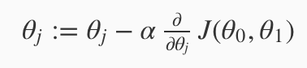
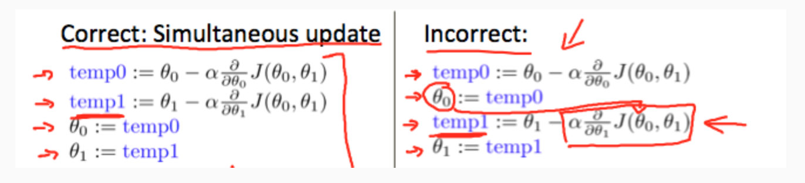

## 监督学习和非监督学习

根据Andrew的描述，监督学习主要有回归(regression)问题和分类(classification)问题，非监督学习主要有聚类(cluster)问题。

## 梯度下降算法

我们在机器学习中非常基础并且重要的一个算法就是梯度下降算法(gradient descent algorithm)，它的原理也比较简单：

其中的 阿尔法 为学习率(我们可以很明显看出来，学习率越大就越aggressive)。

另外我们需要注意的一点就是具体的梯度下降的变更过程应该是同时的，也就是左边的，右边的算法有时候虽然不会产生错误，但是并不是梯度下降算法。

还有，梯度下降会随着距离最优点越来越近，导数越来越小，也就是下降的越来越少。

以上只是二维的情况，实际上我们还可以推广到多个维度。

## 梯度下降算法的一些加快学习效率的策略

#### Feature Scaling

Idea：Make sure features are on a similar scale

如果不同指标之间的数量级差别比较大的话，我们的梯度下降模型用Andrew的话说就是比较“skew elliptical shape”，这样导致的结果就是我们需要花费更多的时间找到最低点，这样是不妥的。

我们可以将各个参数进行归一化(-1到1之间)。

#### Mean normalization

Idea: Replace Xi with Xi - Ui to make features have approximately zero mean(Do not apply to X0 = 1)

让数据的平均值接近0(通常和第一条一起用)

(待确认：一般而言我们用的不是给的数据集现有属性值的平均值和最大最小值，而是给的数据集属性值的理论最大值和理论最小值，以及理论平均值)

#### 正确的选择学习率

如果学习率足够小的话，那么几乎可以做到每次loss都可以降低，如果比较大的话，可能不会每次都降低，甚至可能有的时候不收敛。

我们在训练中可以多尝试不同的学习率，比如0.001，0.01...

#### choose the better feature

Idea: For example, if our hypothesis function is hθ(x)=θ0+θ1x1 then we can create additional features based on x1, to get the quadratic function hθ(x)=θ0+θ1x1+θ2x1^2 or the cubic function hθ(x)=θ0+θ1x1+θ2x1^2+θ3x1^3

正确的设计参数，有时候可以对训练模型有很大的促进作用

