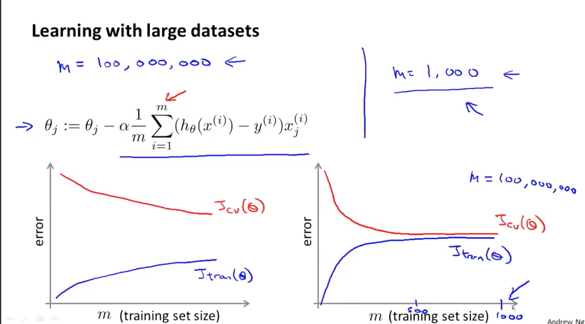
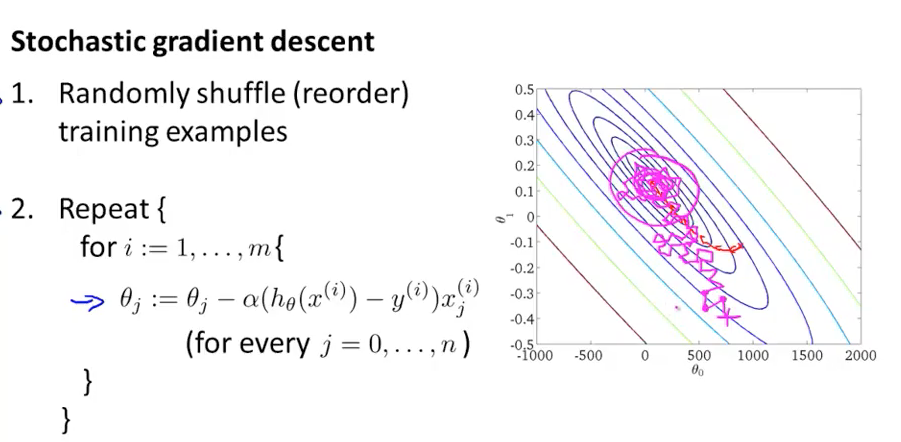
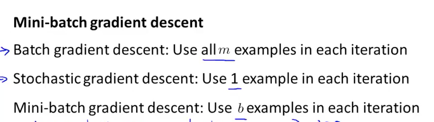
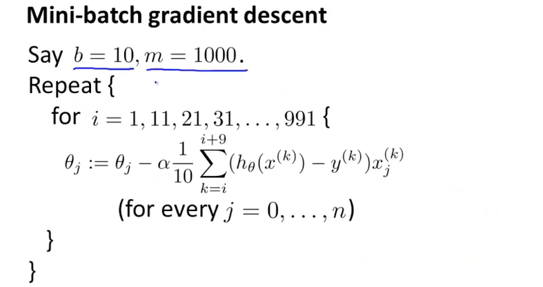
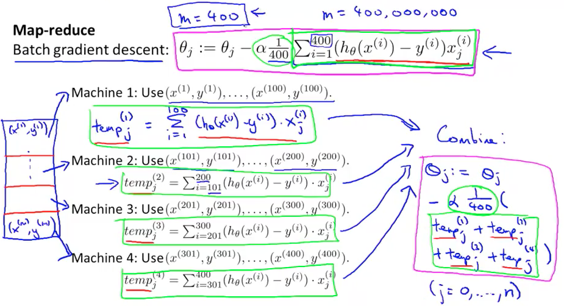

### Learning with large dataset

我们如何来判断如果当数据量增大时我们的算法会表现的更好呢？

见下图，我们观察如下学习曲线：

如果是左图的情况我们增加数据是有必要的，如果是右图的情况我们可能需要寻找别的解决方案(比如增加隐藏层等)。

### Stochastic Gradient Descent(SGD)

Gradient Descent存在一些问题，就是当数据量很大的时候，我们每次计算梯度都要遍历所有的数据，这个消耗是非常大的，所以后来又有了随机梯度下降。

>随机梯度下降是通过每个样本来迭代更新一次，如果样本量很大的情况（例如几十万），那么可能只用其中几万条或者几千条的样本，就已经将theta迭代到最优解了，对比上面的批量梯度下降，迭代一次需要用到十几万训练样本，一次迭代不可能最优，如果迭代10次的话就需要遍历训练样本10次。但是，SGD伴随的一个问题是噪音较BGD要多，使得SGD并不是每次迭代都向着整体最优化方向。

### Mini-batch gradient descent

一张图表明三者之间的关系：

伪代码：

如果向量化做的好，这种方式的效率也是非常高的。

#### 判断收敛

每n次迭代打印一次cost，可视化。

我们发现如果n越大，曲线越平滑，如果是曲线呈现下降趋势，那么说我们的方法是有效的。

(如果反而上升，我们应该选择更小的学习率进行尝试)

### Online Learning

#### Map reduce

多机 MapReduce；多核 MapReduce

 

 

