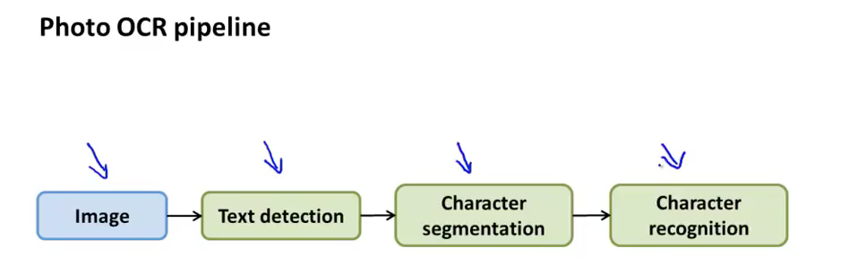

### Photo OCR

pipeline:

### Getting lots of data

首先确定多的data可以提高实验效果。

### Ceiling Analysis

What part of the plpeline should you spend the most time trying to improve?

如果某一个部分的正确率提高到100%，那么整个实验的正确率会提高到多少？

