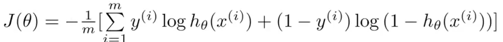
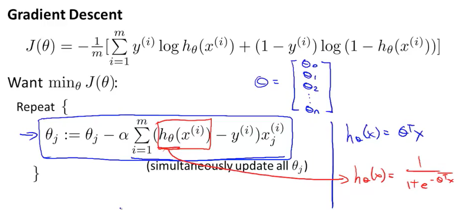
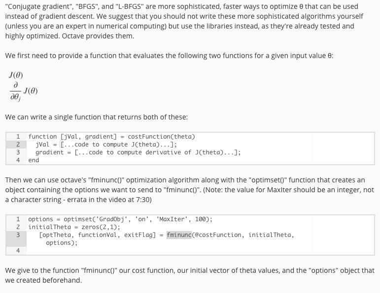
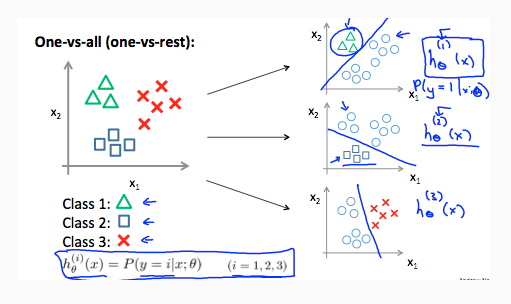
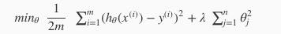
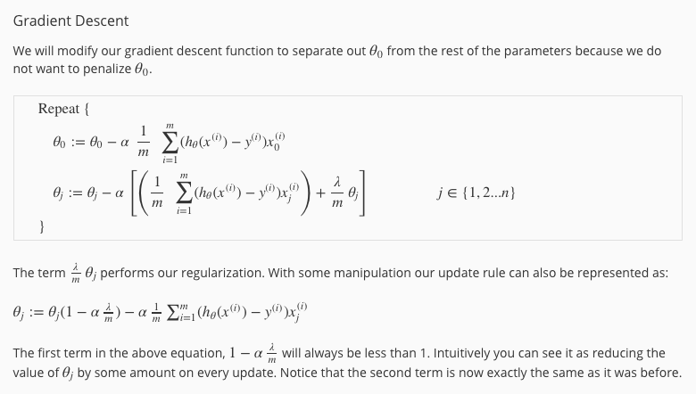
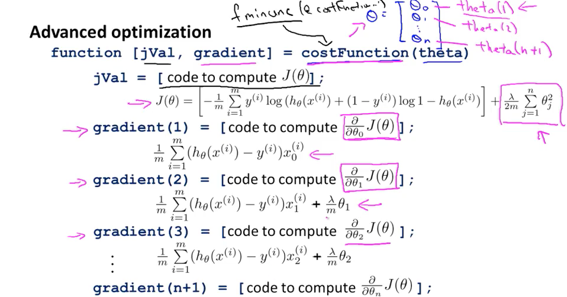

上一章的梯度下降算法并不是特别适合解决分类问题，但是可以基于此进行改造从而可以来训练分类问题。

首先我们使用 "Sigmoid Function," 或者叫做 "Logistic Function":

然后我们对损失计算函数也要变化一下：

损失函数经过简化，可以变成如下：

我们如果对其计算每次theta的迭代值，发现和linear regression没有什么不一样，实际上不一样的地方在于h(x)，这个在下图中有说明：

### 高级方法

在解决这类问题的时候，除了运用梯度下降(笔者注: 感觉这部分概念比较复杂，个人理解是Logistic回归是概念，梯度下降是方法)，实际上还有很多更高级的方法，这些高级方法在Octave中有所提供，相关内容可以参见下图：

### one-vs-all

多分类问题其实很常见，对于k项多分类问题我们实际上只要k个二分类问题，然后确定哪一个二分类得出的概率是最大的，就说明是哪一类。

### overfitting

overfitting 的问题已经不是新问题了，之前在学习 tensorflow 的时候就遇到过这种问题，但是当时没有真正的理解正则化：

正则化的目的，就是适当的减小 theta 的值，从而让曲线更平滑一些，防止曲线过于陡峭，正则化为什么能成功，我觉得实际上是比较迷的，但是自己尝试之后就会发现它真的会取得效果。

对于线性回归问题的梯度下降来说，这其实就是每次在优化 theta 的时候会有一些变化，可以参考下图的公式：

稍微解释一下的话其实就是每次重新计算 theta 的时候重新 shrink 一下。

如果是Logistic回归的话公式其实基本是一样的，这个时候如果我们需要使用之前提到的高级方法，那么我们的jVAl(如何计算costfunction)和gradient(梯度下降的幅度)该如下定义：

