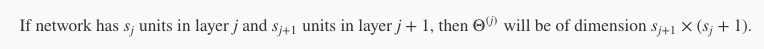
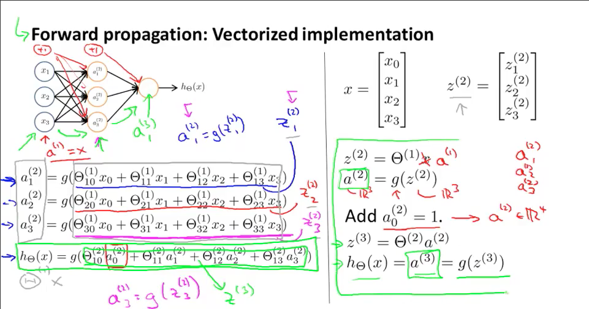
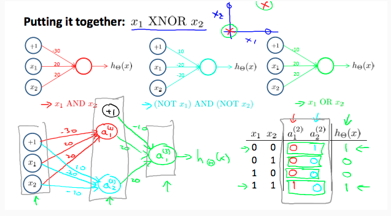

### The basic of Neural Network

关于神经网络中 theta(matrix of weights controlling function mapping from layer j to layer j+1) 如何计算的问题，自己一开始没完全特别get，这里mark一下：



需要注意的就是究竟在哪一层考虑隐藏层的链接，以及是如何计算的。

**神经网络的向量化表示**



其中:

* a 表示 "activation units.", 实际上就是经过激活函数计算之后的值
* g 表示激活函数，实际上就是 1 / (1 + e ^ -z)
* z 表示经过权重加权之后上一层传来的结果
* x 为输入值
* Theta 表示权重


### 非线性分类

视频中举的非线性分类的例子是异或(之前听蔡登讲异或没有明白，现在终于明白了...)，异或分类这种非线性问题通过普通的线性回归是不容易解决的，但是通过多层神经网络可以非常方便的解决：

(虽然我觉得图中好像是弄反了...但是思想是没错的)




### 我对神经网络解决分类问题的一点理解

从上面的XNOR的例子我们可以看出，神经网络可以解决一般的线性回归不方便解决的问题(并不是不能解决，我们采用one-vs-all的方案其实还是可以解决的，就是在特征太多的时候，特别费时并且会有一定的计算冗余)。

而神经网络，实际上我认为就是一个将属性抽象的过程，比如一个训练对象，我们有400维的属性(一个20*20的灰度图片也可以看成有400维的属性)，我们可以先经过一层隐藏层将这400维的属性变成25维，这25维度的属性实际上每一个维度都或多或少受到400维度的属性的影响，是一个“更高层次的属性”，但是这个时候，它已经失去了物理意义了。

然后再经过输出层，我们就可以将这个25维度的属性映射为10个概率(在手写数字识别数据集中分别对应0-9)。

通过多的这一个隐藏层，实际上我们能从原图中抽取更多的信息，从而使用神经网络比使用一般的one-vs-all的方式拥有更高的准确率(97% : 94%)。

```
// 一个非常典型的只有一个隐藏层的神经网络正向传播的例子: 
z2  = [ones(m, 1) X] * Theta1';
a2  = sigmoid(z2);

m2 = size(a2,1);
z3 = [ones(m2, 1) a2] * Theta2';
a3 = sigmoid(z3);

[tp, p] = max(a3, [], 2);
```

当然，目前的理解还很浅薄，接下来要学习更多的内容。