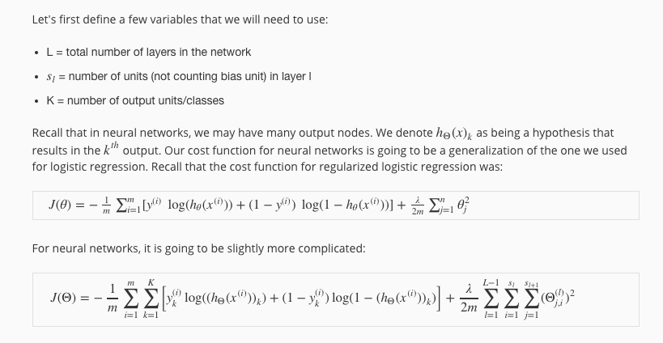
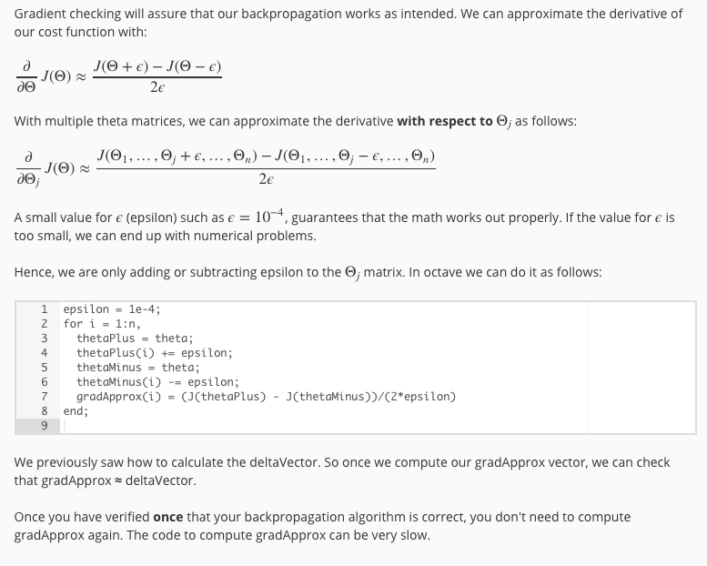
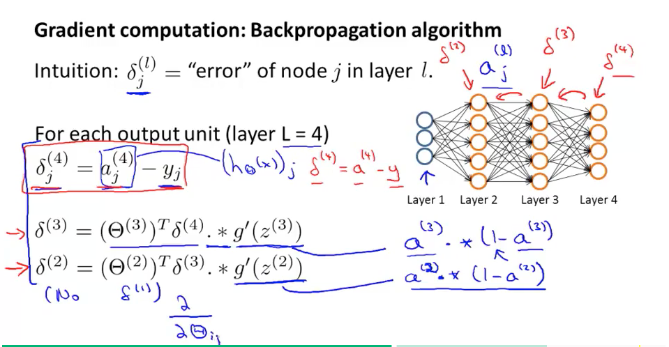
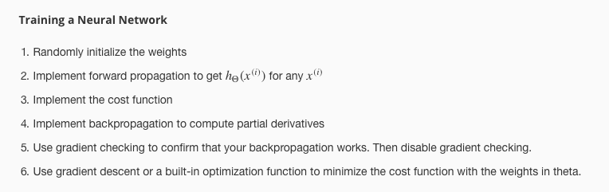

### Cost Function for NN

神经网络的Cost Function基于原来的regularized logistic regression的Cost Function进行了一些变动:




### Gradient Checking

在我们训练我们的分类器的过程中，有的时候一点点错误并不会导致整个程序crash，而是会降低准确率，所以我们需要 Gradient Checking 。(注意我们在真正的训练迭代的过程中不能每次迭代都检查，这样会代价很高，而原本的反向传播算法会比下图中提到的算法更加快捷)。



### Random Initialization

如果我们在神经网络中把Theta的初始化值都设置为0，那么由于反向传播算法的特点是不能正有效工作的。
所以我们要一开始对其进行随机化。

```
Theta1 = rand(10,11) * (2 * INIT_EPSILON) - INIT_EPSILON;
Theta2 = rand(10,11) * (2 * INIT_EPSILON) - INIT_EPSILON;
Theta3 = rand(1,11) * (2 * INIT_EPSILON) - INIT_EPSILON;
```

### Backpropagation

误差反向传播是一个神经网络的关键步骤。这个步骤初步理解起来比较容易，但真正实现起来并不是特别容易，下面我以matlab代码为例简单简述实现流程：

(这里假设我们是一个三层的神经网络，即一个输入层、一个输出层和一个隐藏层)

* 我们在进行误差反向传播的过程中，首先需要计算z2、a2、z3、a3:

```
z2 = [ones(m, 1) X] * Theta1';
a2 = sigmoid(z2);

z3 = [ones(m, 1) a2] * Theta2';
a3 = sigmoid(z3);
```

* 我们可以利用上面的计算结果计算出误差J:

```
% 先要格式化y
newY =  zeros(size(y,1),num_labels);

disp('newY size:');
disp(size(newY));

for i = 1:m
  newY(i, y(i)) = 1;
  for k = 1:num_labels
    J = J + ( -newY(i,k) * log(a3(i,k)) - (1-newY(i,k)) * log(1 - a3(i,k)) );
  end
end  

J = J + lambda / 2 * ( sum(sum( Theta1(:,2:end) .^ 2)) + sum(sum( Theta2(:,2:end) .^ 2)) )

J = J / m;
```

* 然后我们需要进行一个循环，循环每一条训练数据`for t = 1:m`
	* 循环中的第一步就是将a1赋值(注意a1和之前计算好的a2和a3维度并不一样)
	
	```
	a1 = [1; X(t,:)'];  
  	%      401 * 1
	```
	* 然后我们可以很方便的计算出最后一层的误差：
	
	```
   temp_theta3 = (a3(t,:) - newY(t,:))';
  	%   10 * 1     1:10     1:10
	```
	
	* 在计算第二层的误差的时候，我们最好是可以参照公式(下图)，最后代码如下：
	
	```
	temp_theta2 = (Theta2' * temp_theta3) .* sigmoidGradient([1;z2(t,:)']);
  	%     26 * 1          26 * 10   10 * 1       26 * 1       
	```
	
	* 最后我们要把算出来的误差累加(这里的Theta2_grad实际上是第三层，Theta1_grad实际上是第二层):

	```
	Theta2_grad = Theta2_grad + temp_theta3 * ([1;a2(t,:)'])';
  	%     10 * 26   10 * 26        10 * 1      1 * 26
   
 	Theta1_grad = Theta1_grad + temp_theta2(2:end,:) * ( a1' );
  	%     25 * 401                 25 * 1      1 * 401
	```

* 循环结束以后，如果需要正则化，我们可以先进行正则化处理：

```
Theta2_grad(:,2:end) = Theta2_grad(:,2:end) + lambda * Theta2(:,2:end);
Theta1_grad(:,2:end) = Theta1_grad(:,2:end) + lambda * Theta1(:,2:end);

Theta2_grad = Theta2_grad  / m;
Theta1_grad = Theta1_grad  / m;
```	

参考课件：
	



### 组建一个神经网络的一般步骤

一般来说，神经网络的输入的维度(单元数目)就是我们训练数据的维度，输出就是最后要分类的类别数目。

对于隐藏层来说，一般来说默认一个隐藏层，但是隐藏层数目越多通常效果越好，如果是多个隐藏层，建议各个隐藏层之间的节点数相同即可，节点数目也是越多越好，通常会考虑计算复杂度。

我们通过以下六个步骤训练神经网络：


