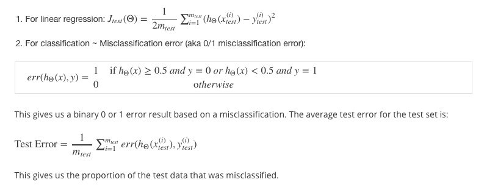
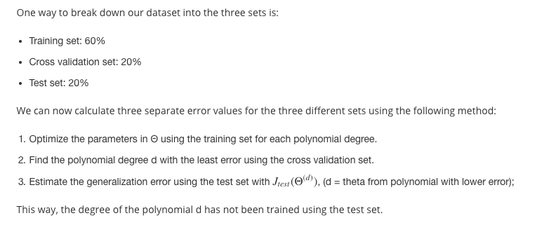
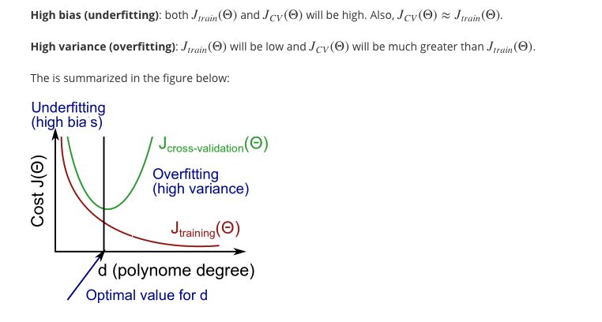
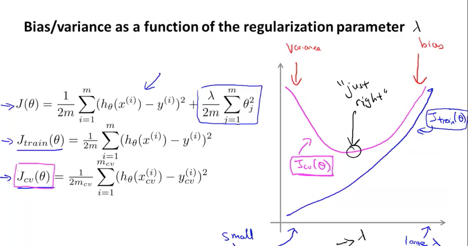
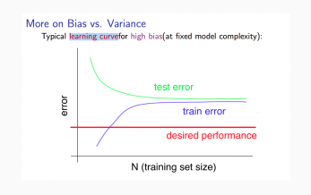
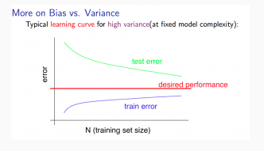

### Evaluating a Learning  Algorithm

当我们的训练模型出现问题的时候，我们需要进行模型的调整，通常我们的调整有这几个方向：

* Getting more training examples
* Trying smaller sets of features
* Trying additional features
* Trying polynomial features
* Increasing or decreasing λ

为了避免太多浪费，我们需要先行评估我们的模型，将数据分为训练集和测试集，一般二者的比例是7:3。

#### The test set error

#### Train/Validation/Test Sets

大多数时候，我们不是将数据集分为训练集和测试集，而是将数据集分为Train Set、Validation Set、Test Sets。这是因为我们根据Validation Set选择合适的模型的时候，实际上已经有了倾向性了，选择了表现最好的参数，这个时候的错误率可能不是最公正的，所以我们需要通过Test Sets来得出一个相对公正的错误率。

参考:

#### overfitting & underfitting

一般来说，随着我们多项式指数的增多，测试集和验证集的错误率大致满足如下要求：

#### Regularization 对正确率的影响

如果Regularization 的系数 Lamda 太小，实际上会造成过拟合(本来Regularization就是解决过拟合的问题的)，如果太大，就会造成 Bias 过大，都会导致不精确。

大致满足如下趋势关系(注意实际得出的图会有很多噪声):

#### Learning Curves

学习率曲线 Learning Curves 的横坐标是 training set size， 纵坐标是错误率。

如果我们的拟合函数次数比较低(或者说我们的模型bias较高)，学习率曲线通常是这样的：

如果我们的拟合函数次数比较高(或者说我们的模型variance较高，即过拟合)，学习率曲线通常是这样的：

#### Deciding What to Do Next Revisited

总结：

|Method|effect|
|-----|-----|
|Getting more training examples|Fixes high variance|
|Trying smaller sets of features|Fixes high variance|
|Adding features|Fixes high bias|
|Adding polynomial features|Fixes high bias|
|Decreasing λ|Fixes high bias|
|Increasing λ|Fixes high variance|

Diagnosing Neural Networks

* A neural network with fewer parameters is prone to underfitting. It is also computationally cheaper.
* A large neural network with more parameters is prone to overfitting. It is also computationally expensive. In this case you can use regularization (increase λ) to address the overfitting.

### 解决机器学习问题的一般步骤

* Start with a simple algorithm, implement it quickly, and test it early on your cross validation data.   
* Plot learning curves to decide if more data, more features, etc. are likely to help.   
* Manually examine the errors on examples in the cross validation set and try to spot a trend where most of the errors were made.

### 其他

本周内容最后介绍了一些Presicion、Recall的一些相关问题，这些问题的概念还是比较好理解的，就是有时候有点绕。

[参考链接](http://www.cnblogs.com/bluepoint2009/archive/2012/09/18/precision-recall-f_measures.html)

