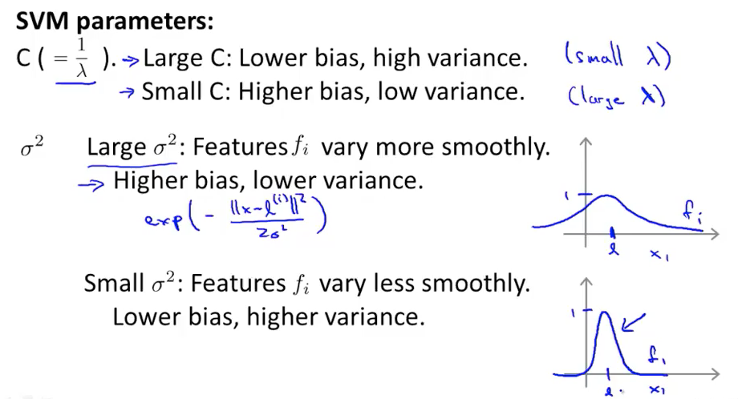
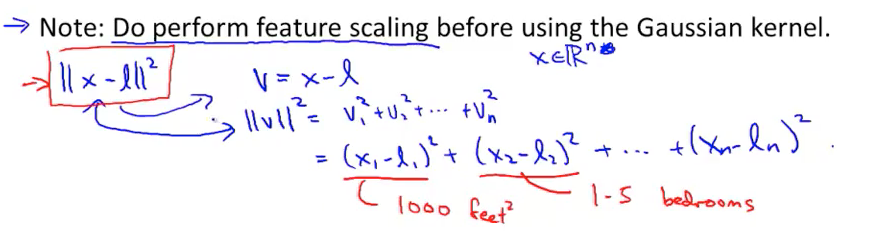
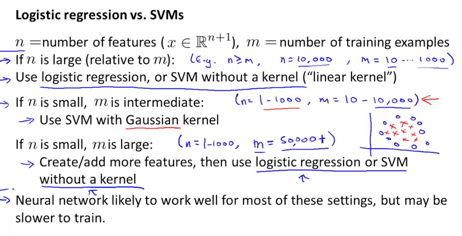

### SVM

>对这一章讲的内容而言，主要是要

本周主要讲了SVM的相关内容，相关内容深究的话有很多值得推敲的地方，这里记录下一些重点。

SVM可以有不带核（kernel）的SVM(线性SVM)，以及带核的SVM。

SVM的参数和过拟合以及欠拟合的关系如下：
(high bias意味着欠拟合，high variance意味着过拟合)

我们在使用Gaussian Kernel的时候记住要先对属性进行缩放，否则属性差太多，就会有些范围小的无法起到效果。

Logistic 和 SVM：

（Logistic regression 和 不带核的 SVM是很相似的）