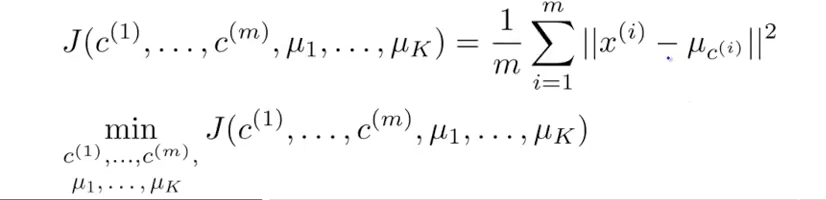

### Unsupervised Learning

#### K-means

K-means的做法比较简单，主要分为以下几个部分(假设我们有k个分类)：

* 随机选择k个点初始化坐标(一般来讲，我们推荐的方式是从数据集中选择k个节点的值赋给k个分类点)
* 对所有点进行标记，标记为距离最近的分类点的索引
* 将所有的分类点移动到平均值

最后的目标就是降低 J 值：

(u为分类节点序列，c(i)为第i个节点的分类索引，值在1-k之间)

>这里有一点值得注意的地方：J随着迭代是不会增加的，只会减小。

我们可以使用伪代码来表示K-means的过程：

##### K-means的分类数目选择

目前，大多数场景下我们采用直接观察或者根据我们的需求来决定K-means的分类数目，但是我们在某些场景下也可以采用“Elbow”分析法：

很简单，我们需要画出分类数目-J的关系图，然后选出拐点部分，一般是比较合理的。

#### PCA

PCA虽然是一个已经过气了的方法，但是这里还是做一下简单记录。

注意PCA之前我们需要进行一些数据标准化：

PCA的主要过程：

What PCA does is find a map X(m维) to Z(k维)

值得注意的一点是，并不建议使用PCA来防止overfitting(虽然的确可以但是这个并不是一个好的做法)。

以及，PCA是可以根据恢复矩阵得到原始值的。

PCA降维到k维，那么我们怎么选择这个k值呢？

 
