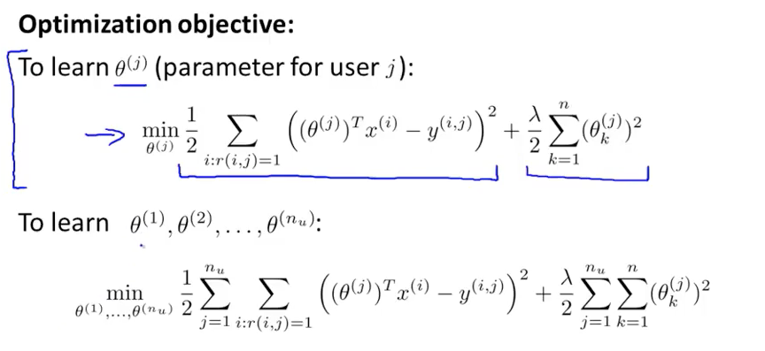

### Anomaly detection

Anomaly detection 是利用正态分布(高斯分布)进行异常检测。

#### VS. supervised learning

我们什么时候该使用这种(基于正态分布的)异常检测，以及什么时候该使用有监督学习呢？

以下两个图给出了一些参考：

总结：如果我们的positive例子比较多(需要被检测出来的有问题的)，并且可能出问题的地方比较集中(抽象的理解就是，可以学习出一种modal，跟这种modal比较像的肯定是要被检测出来的)，这个时候使用Supervised Learning就比较好。

反过来，我们的正例较少，并且异常五花八门(可能是这个参数有问题，也可能是那个参数有问题)，这个时候对机器学习来说可能比较困难，这个时候可以选择基于正态分布的异常检测。

#### Choose Features

 * 选择接近高斯分布的参数或者把参数变成接近高斯分布。

 如果有些我们要选择的参数并不是特别符合高斯分布，我们可以通过一些变换使其符合高斯分布(比如变成log、或者n分之一次方)
 
 * 如果当前的参数无法检测出异常，我们可以寻找新的参数，或者根据当前参数来生成新的参数(比如两个参数相除)等

#### Multivariate Gaussian Distribution

多维高斯分布(举例了二维高斯分布，值得注意的是标准差变成了一个 2*2 的矩阵)

数学表示：

如何选择：

### collaborative filtering system

用作推荐系统，课程中给了一个这样的场景：

有一些样本电影，然后有一个n1维的标签可以给这些电影打标签(Theta)(比如浪漫、暴力、等等，值为0-1)，有一些用户对电影的评分(并不是所有的都有，部分用户对部分电影没有评分)

现在的假设是用户对电影的评分满足一个函数关系，即他对各个类别打分的权重决定了对这个电影的评分(虽然我对这个不认同)

这样就可以学习用户的权重系数，也可以学习电影的标签权重，也可以在什么都没有得情况下迭代互相学习。

我们的定义如下：

如果我们要学习电影的标签系数：

如果我们要学习用户的打分权重：

共同学习：

整个场景的矩阵表示：

>建议看课程视频，讲的很明白，我觉得如果有特别好的场景，这个方式还是可以用用的。

 

 